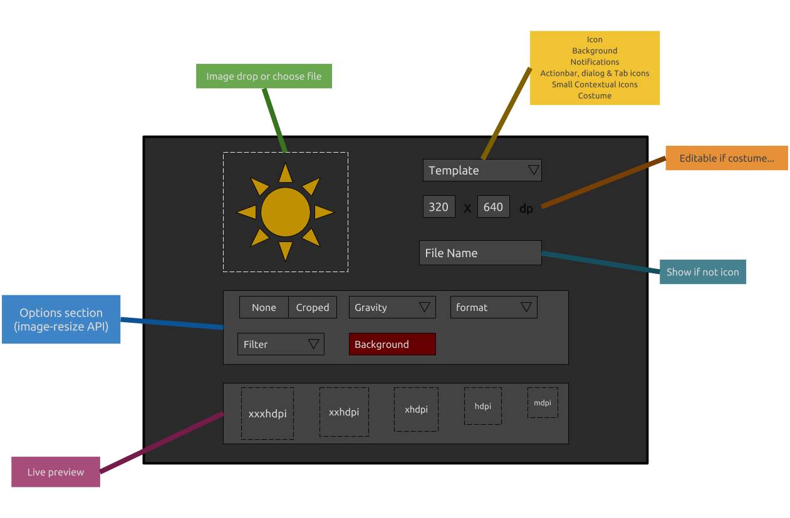

# Android Image resizer

## Description

- resize images to default android layout groups

## Draft

## Templates

| Name                            | width | heigt | Units |
|---------------------------------|:-----:|:-----:|:-----:|
| Icon launcher                   | 48    | 48    | dpi   |
| Background                      | 360   | 640   | dpi   |
| Action bar, Dialogs & Tab icons | 32    | 32    | dpi   |
| Notifications                   | 24    | 24    | dpi   |
| Small contextual icons          | 16    | 16    | dpi   |

[reference](http://iconhandbook.co.uk/reference/chart/android/)